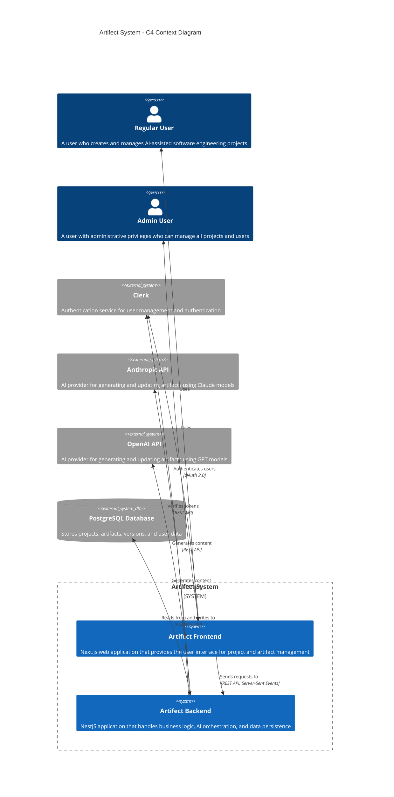

# Artifect - AI-Assisted Software Engineering Platform

Artifect is a comprehensive platform that leverages AI to assist in the software engineering process, from requirements gathering to design, helping teams create higher quality artifacts with greater efficiency.

## System Overview

Artifect enables software engineering teams to create, manage, and iterate on software development artifacts with AI assistance. The system supports a structured workflow through different phases of development (Requirements, Design, etc.) and uses large language models to generate and refine content.

### C4 Context Diagram



## Key Features

- **AI-Assisted Artifact Creation**: Generate high-quality software engineering artifacts with AI assistance
- **Software Development Lifecycle Support**: Structured workflows for Requirements, Design, and other phases
- **Multiple AI Providers**: Support for both Anthropic (Claude) and OpenAI (GPT) models
- **Real-time Collaboration**: Server-sent events for streaming AI responses in real-time
- **Version Control**: Track changes to artifacts over time
- **State Management**: Workflow states (To Do, In Progress, Approved) for tracking artifact progress
- **User Management**: Role-based access control with admin capabilities
- **Project Organization**: Group artifacts by projects and development phases

## Architecture

Artifect uses a modern, microservices-based architecture:

- **Frontend**: Next.js application for a responsive and interactive user experience
- **Backend**: NestJS application with a clean, modular architecture
- **Authentication**: Clerk for secure user authentication and management
- **Database**: PostgreSQL with Prisma ORM for data persistence
- **AI Integration**: API integrations with Anthropic and OpenAI

## Getting Started

### Prerequisites

- Node.js 18+
- PostgreSQL 13+
- pnpm (package manager)
- API keys for:
  - Clerk
  - Anthropic
  - OpenAI (optional)

### Installation

1. Clone the repository:

   ```bash
   git clone https://github.com/yourusername/artifect.git
   cd artifect
   ```

2. Install dependencies:

   ```bash
   pnpm install
   ```

3. Set up environment variables:

   ```bash
   cp .env.example .env
   # Edit .env with your API keys and configuration
   ```

4. Set up the database:

   ```bash
   cd apps/backend
   pnpm run db:migrate:dev
   pnpm run db:seed
   ```

5. Start the development servers:
   ```bash
   pnpm run dev
   ```

## Configuration

Artifect can be configured using environment variables:

### Backend Configuration

- `PORT`: Server port (default: 3000)
- `DATABASE_URL`: PostgreSQL connection string
- `NODE_ENV`: Environment (development, production, test)

### Authentication Configuration

- `CLERK_API_KEY`: Clerk API key
- `CLERK_JWT_AUDIENCE`: JWT audience for token verification
- `CLERK_API_BASE_URL`: Clerk API base URL

### AI Provider Configuration

- `DEFAULT_AI_PROVIDER`: Default AI provider (anthropic, openai)
- `ANTHROPIC_API_KEY`: Anthropic API key
- `ANTHROPIC_DEFAULT_MODEL`: Default Anthropic model (e.g., claude-3-opus-20240229)
- `OPENAI_API_KEY`: OpenAI API key
- `OPENAI_DEFAULT_MODEL`: Default OpenAI model (e.g., gpt-4)

## Development

### Project Structure

The project uses a monorepo structure managed by Turborepo:

```
artifect/
├── apps/
│   ├── backend/       # NestJS backend application
│   └── frontend/      # Next.js frontend application
├── packages/
│   └── shared/        # Shared types and utilities
├── turbo.json         # Turborepo configuration
└── package.json       # Root package.json
```

### Available Scripts

- `pnpm run dev`: Start all applications in development mode
- `pnpm run build`: Build all applications
- `pnpm run test`: Run tests for all applications
- `pnpm run lint`: Lint all applications
- `pnpm run clean`: Clean build artifacts

#### Backend Scripts

- `pnpm run db:migrate:dev`: Run database migrations
- `pnpm run db:seed`: Seed the database
- `pnpm run db:studio`: Open Prisma Studio

## Technologies

### Frontend

- Next.js
- React
- Tailwind CSS
- Clerk (Authentication)

### Backend

- NestJS
- TypeScript
- Prisma (ORM)
- PostgreSQL
- Anthropic & OpenAI API integrations
- Server-Sent Events for real-time communication

### DevOps & Tools

- Turborepo
- pnpm
- Jest (Testing)
- ESLint & Prettier

## License

[MIT](LICENSE)
