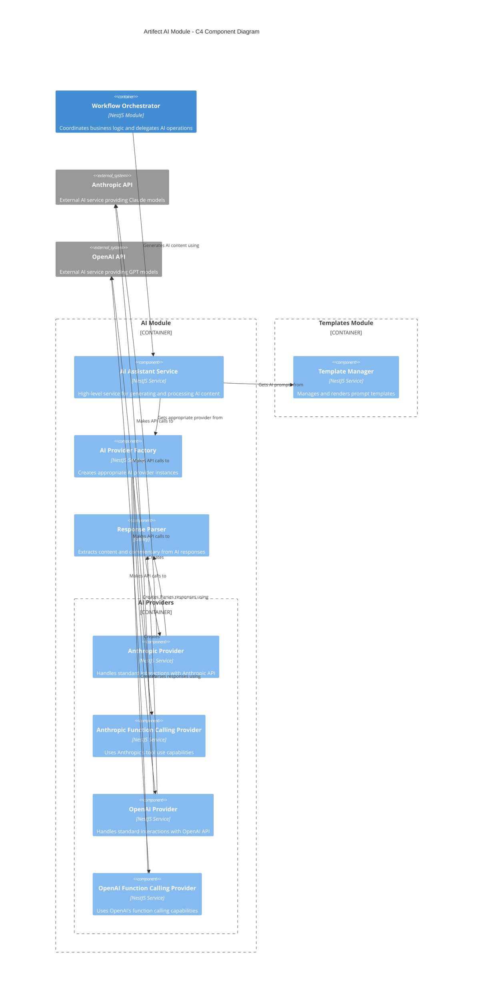

# AI Module

This module provides integration with AI services for the AI-Assisted Software Engineering Platform.

## Architecture

The AI module connects the application with various AI providers (e.g., OpenAI, Anthropic) to generate artifacts based on templates and user inputs. It handles the communication with these services, processes responses, and formats the content appropriately. Below is a C4 component diagram illustrating the system architecture:



### Key Components

- **AI Assistant Service**: High-level service providing methods for artifact generation and AI interactions
  - Manages both standard and streaming AI interactions
  - Coordinates prompt templates and context building
  - Maintains interaction logs for debugging and analysis
- **AI Provider Factory**: Factory for creating and managing AI provider instances
  - Creates appropriate provider based on configuration or explicit selection
  - Manages registration and lookup of available providers
  - Handles provider fallbacks and defaults
- **Response Parser**: Utility for standardizing AI responses across providers
  - Extracts artifact content and commentary from raw responses
  - Validates response formats and structure
  - Handles error cases and empty responses
- **AI Providers**: Implementations for different AI services
  - **Anthropic Provider**: Standard text generation with Claude models
  - **Anthropic Function Calling Provider**: Structured outputs using tool use
  - **OpenAI Provider**: Standard text generation with GPT models
  - **OpenAI Function Calling Provider**: Structured outputs using function calling

## Provider Implementation Approaches

The module offers two implementation approaches for each AI provider:

1. **Traditional Prompting**: Uses a standard text-based prompt with formatting instructions

   - Suitable for simpler use cases
   - More flexible as it works with any model version
   - Found in `anthropic.provider.ts` and `openai.provider.ts`

2. **Function/Tool-based**: Uses the provider's function calling or tool use capabilities
   - Provides more structured output
   - Better separation of artifact content and commentary
   - Requires models that support these capabilities
   - Often results in higher quality outputs for structured tasks
   - Found in `anthropic-function-calling.provider.ts` and `openai-function-calling.provider.ts`

## Interfaces and Models

### AI Provider Interface

All AI providers implement this common interface:

```typescript
interface AIProviderInterface {
  generateResponse(
    systemPrompt: string,
    userPrompt: string,
    artifactFormat: ArtifactFormat,
    isUpdate: boolean,
    conversationHistory?: AIMessage[],
    model?: string,
  ): Promise<AIRequestResponse>;

  parseResponse(
    response: string,
    artifactFormat: ArtifactFormat,
    isUpdate: boolean,
  ): Promise<AIModelResponse>;

  generateStreamingResponse?(
    systemPrompt: string,
    userPrompt: string,
    artifactFormat: ArtifactFormat,
    isUpdate: boolean,
    conversationHistory?: AIMessage[],
    model?: string,
    onChunk?: (chunk: string) => void,
  ): Promise<AIRequestResponse>;
}
```

### Response Models

```typescript
interface AIModelResponse {
  rawResponse: string;
  artifactContent?: string;
  commentary?: string;
}

interface AIRequestResponse {
  formattedSystemPrompt?: string;
  formattedUserPrompt: string;
  rawResponse: string;
  parsedResponse?: AIModelResponse;
  metadata?: Record<string, any>;
}

interface AIMessage {
  role: string;
  content: string;
}
```

## Key Features

### Multiple Provider Support

The AI Module supports multiple providers and integration methods:

- **Anthropic (Claude)**: Standard text completion and streaming with Claude models
- **OpenAI (GPT)**: Standard text completion and streaming with GPT models
- **Structured Outputs**: Tool use (Anthropic) and function calling (OpenAI) for consistent response formats

### AI Response Formats

The module standardizes responses across providers into two key components:

- **Artifact Content**: The actual content to be stored in the artifact (e.g., requirements document, design diagram)
- **Commentary**: Additional explanations, questions, or notes from the AI to the user

### Streaming Responses

For real-time user experience, the module supports streaming responses:

- **Chunk-by-Chunk Processing**: Delivers content as it's generated
- **Progress Reporting**: Allows for real-time UI updates
- **Completion Handling**: Finalizes responses once complete

### Logging and Debugging

Comprehensive logging for troubleshooting AI interactions:

- **Logs Input Context**: Stores the context provided to the AI
- **Logs Raw Responses**: Records the unmodified responses from providers
- **Logs Parsed Results**: Records the extracted content and commentary
- **Error Tracking**: Captures and logs errors during AI interactions

All AI interactions are logged to the `_ai_logs` directory with timestamps and relevant context information. These logs can be useful for debugging, tracking, and improving the AI interactions.

## Usage Examples

### Basic Artifact Generation

```typescript
import { AIAssistantService } from './ai/ai-assistant.service';

@Injectable()
class MyService {
  constructor(private aiAssistant: AIAssistantService) {}

  async generateArtifact(context: Record<string, any>) {
    const result = await this.aiAssistant.generateArtifact(
      context, // Context data for generation
      false, // Not an update
      undefined, // No user message
      'anthropic', // Provider ID
      'claude-3-opus-20240229', // Model name
    );

    const { artifactContent, commentary } = result;
    // Use the generated content...
  }
}
```

### Streaming Artifact Updates

```typescript
import { AIAssistantService } from './ai/ai-assistant.service';

@Injectable()
class StreamingService {
  constructor(private aiAssistant: AIAssistantService) {}

  async streamArtifactUpdate(
    context: Record<string, any>,
    userMessage: string,
    onChunk: (chunk: string) => void,
  ) {
    const result = await this.aiAssistant.generateStreamingArtifact(
      context, // Context data
      true, // Is an update
      userMessage, // User's request
      onChunk, // Callback for chunks
      'openai', // Provider ID
      'gpt-4', // Model name
    );

    return result; // Final complete result
  }
}
```

## Configuration

AI providers are configured via environment variables:

```
# Default provider
DEFAULT_AI_PROVIDER=anthropic

# OpenAI configuration
OPENAI_API_KEY=your-openai-api-key
OPENAI_DEFAULT_MODEL=gpt-4
OPENAI_BASE_URL=https://api.openai.com/v1 (optional)
OPENAI_ORGANIZATION_ID=your-org-id (optional)

# Anthropic configuration
ANTHROPIC_API_KEY=your-anthropic-api-key
ANTHROPIC_DEFAULT_MODEL=claude-3-opus-20240229
ANTHROPIC_BASE_URL=https://api.anthropic.com (optional)
ANTHROPIC_API_VERSION=2023-06-01 (optional)
```

See `ai.config.ts` for all available configuration options and defaults.

## Error Handling

The AI Module implements robust error handling:

- **API Errors**: Handles rate limiting, authentication, and service errors
- **Timeout Handling**: Manages long-running requests and retries
- **Content Validation**: Ensures responses contain required elements
- **Graceful Degradation**: Falls back to alternative providers when available

## Testing

The AI module includes comprehensive test coverage for all components:

- **Provider Tests**: Each provider has dedicated test suites that verify:

  - API request/response handling
  - Error management
  - Conversation history handling
  - Response parsing
  - Streaming functionality

- **AIAssistantService Tests**: Verify the service correctly coordinates with providers and templates

- **AIProviderFactory Tests**: Ensure proper provider registration and selection

- **Response Parser Tests**: Validate the extraction and validation of content from AI responses

To run the tests:

```bash
# Run all tests
npm test

# Run only AI module tests
npm test -- src/ai

# Run only OpenAI provider tests
npm test -- src/ai/openai
```

## Extending

To add a new AI provider:

1. Create a new provider class that implements `AIProviderInterface`
2. Create corresponding spec file for testing
3. Add it to the appropriate subfolder or create a new one
4. Update the barrel file for the subfolder
5. Register it in the `AIProviderFactory`
6. Update the configuration validation schema in `ai.config.ts`
7. Update the `AIModule` to include the new provider
