# API Gateway

This module provides the RESTful API for the AI-Assisted Software Engineering Platform, implementing the endpoints required for client applications to interact with the system.

## Architecture

The API Gateway serves as the central entry point for all client requests, routing them to the appropriate services and handling request/response transformations, validation, error handling, and more. Below is a C4 component diagram illustrating the architecture:

```mermaid
C4Component
    title Artifect API Gateway - C4 Component Diagram

    Container(frontendApp, "Frontend", "Next.js", "Provides the user interface for project and artifact management")

    System_Ext(clerkAuth, "Clerk", "External authentication service")

    Container_Boundary(backendBoundary, "Backend") {
        Container_Boundary(apiGatewayBoundary, "API Gateway") {
            Component(apiModule, "API Module", "NestJS Module", "Main entry point for all API requests")

            Component(healthController, "Health Controller", "NestJS Controller", "Health check endpoint")
            Component(projectController, "Project Controller", "NestJS Controller", "Project management endpoints")
            Component(artifactController, "Artifact Controller", "NestJS Controller", "Artifact management endpoints")
            Component(streamingController, "Streaming Controller", "NestJS Controller", "Server-sent events endpoints")
            Component(aiProviderController, "AI Provider Controller", "NestJS Controller", "AI provider information endpoints")
            Component(userController, "User Controller", "NestJS Controller", "User management endpoints for admins")

            Component(sseService, "SSE Service", "NestJS Service", "Manages server-sent events streams")

            Component(httpExceptionFilter, "HTTP Exception Filter", "NestJS Filter", "Global exception handling")
            Component(loggingInterceptor, "Logging Interceptor", "NestJS Interceptor", "Request/response logging")

            Component(dtoValidation, "DTO Validation", "Class Transformer/Validator", "Request/response validation")
            Component(swaggerDecorators, "Swagger Decorators", "Custom Decorators", "API documentation")
        }

        Component(authGuard, "Auth Guard", "NestJS Guard", "Protects routes from unauthorized access")
        Component(adminGuard, "Admin Guard", "NestJS Guard", "Restricts access to admin-only routes")
        Component(authService, "Auth Service", "NestJS Service", "Authentication logic")

        Component(workflowOrchestrator, "Workflow Orchestrator", "NestJS Service", "Coordinates business logic")
        Component(aiAssistant, "AI Assistant", "NestJS Service", "Manages AI provider interactions")
        Component(repositoriesModule, "Repositories Module", "NestJS Module", "Data access layer")
    }

    Rel(frontendApp, apiModule, "Makes requests to", "REST API, SSE")

    Rel(apiModule, healthController, "Routes to")
    Rel(apiModule, projectController, "Routes to")
    Rel(apiModule, artifactController, "Routes to")
    Rel(apiModule, streamingController, "Routes to")
    Rel(apiModule, aiProviderController, "Routes to")
    Rel(apiModule, userController, "Routes to")

    Rel(apiModule, httpExceptionFilter, "Uses")
    Rel(apiModule, loggingInterceptor, "Uses")

    Rel(streamingController, sseService, "Uses")

    Rel(projectController, workflowOrchestrator, "Delegates to")
    Rel(artifactController, workflowOrchestrator, "Delegates to")
    Rel(streamingController, workflowOrchestrator, "Delegates to")
    Rel(aiProviderController, aiAssistant, "Gets info from")
    Rel(userController, repositoriesModule, "Accesses user data via")

    Rel(apiModule, authGuard, "Protected by")
    Rel(userController, adminGuard, "Protected by")
    Rel(authGuard, authService, "Uses")
    Rel(adminGuard, authService, "Uses")

    Rel(authService, clerkAuth, "Verifies tokens with")
```



### Key Components

- **Controllers**: Handle incoming HTTP requests and return responses to the client

  - **HealthController**: Provides a health check endpoint
  - **ProjectController**: Manages project CRUD operations
  - **ArtifactController**: Handles artifact creation, updates, and interactions
  - **StreamingController**: Handles real-time streaming responses for AI interactions
  - **AIProviderController**: Provides information about available AI providers
  - **UserController**: Admin-only endpoints for user management

- **Cross-Cutting Concerns**:

  - **HTTP Exception Filter**: Provides consistent error response formatting
  - **Logging Interceptor**: Logs all API requests and responses
  - **Auth Guard**: Protects routes from unauthorized access
  - **Admin Guard**: Restricts access to admin-only routes

- **Services**:
  - **SSE Service**: Manages Server-Sent Events for real-time streaming of AI responses

## API Endpoints

### Health Check

- **GET /health**: Get application health status

### Projects

- **POST /project/new**: Create a new project
- **GET /project**: List all projects
- **GET /project/:project_id**: Get detailed project information

### Artifacts

- **POST /artifact/new**: Create a new artifact
- **PUT /artifact/:artifact_id**: Update an artifact
- **GET /artifact/:artifact_id**: Get artifact details
- **PUT /artifact/:artifact_id/ai**: Interact with an artifact using AI
- **PUT /artifact/:artifact_id/state/:state_id**: Change artifact state

### Streaming Endpoints

- **POST /stream/artifact/:artifact_id/ai**: Stream interaction with an artifact using AI, with real-time updates delivered via Server-Sent Events (SSE)

### AI Providers

- **GET /ai-providers**: List available AI providers and models

## Headers

The API supports the following custom headers:

- **X-AI-Provider**: Specify the AI provider to use (e.g., "anthropic", "openai")
- **X-AI-Model**: Specify the AI model to use (e.g., "claude-3-opus-20240229", "gpt-4")

## Response Format

All responses follow a consistent format:

- Success responses return the requested data directly
- Error responses include:
  - `statusCode`: HTTP status code
  - `message`: Error description
  - `error`: Error type
  - `timestamp`: When the error occurred
  - `path`: Request path
  - `method`: HTTP method

### Streaming Response Format

Streaming endpoints use Server-Sent Events (SSE) format with the following structure:

- Each event contains a chunk of the response as a JSON object:
  - `chunk`: A piece of generated text
  - `done`: Boolean indicating if this is the final chunk (only in last event)
  - `artifact_content`: Complete artifact content (only in last event)
  - `commentary`: Complete commentary (only in last event)

Example streaming response:

```
data: {"chunk":"I'll "}
data: {"chunk":"help "}
data: {"chunk":"you "}
data: {"chunk":"design "}
data: {"chunk":"this "}
data: {"chunk":"feature."}
data: {"chunk":"", "done":true, "artifact_content":"# Feature Design\n\n...", "commentary":"I've created a design that..."}
```

## Using Streaming Endpoints

To consume streaming endpoints in a frontend application:

1. Make a POST request to the streaming endpoint with appropriate headers
2. Set `Accept: text/event-stream` header
3. Process the response as a stream of Server-Sent Events
4. Update the UI in real-time as chunks arrive
5. Handle the final event with complete content

```javascript
fetch('/api/stream/artifact/123/ai', {
  method: 'POST',
  headers: {
    'Content-Type': 'application/json',
    Accept: 'text/event-stream',
    'X-AI-Provider': 'anthropic',
  },
  body: JSON.stringify({
    messages: [{ role: 'user', content: 'Design a new feature' }],
  }),
}).then((response) => {
  const reader = response.body.getReader();
  const decoder = new TextDecoder();

  function processChunks() {
    reader.read().then(({ done, value }) => {
      if (done) return;

      const chunk = decoder.decode(value);
      // Process the chunk...

      processChunks(); // Continue reading
    });
  }

  processChunks();
});
```

## API Documentation

The API documentation is available at `/api` when the application is running, powered by Swagger/OpenAPI.

## Testing

The API Gateway includes a comprehensive test suite to ensure proper functionality and catch regressions.

### Test Structure

#### Unit Tests

Unit tests are located alongside the components they test:

- `src/api/controllers/*.spec.ts` - Controller tests
- `src/api/services/*.spec.ts` - Service tests
- `src/api/filters/*.spec.ts` - Filter tests
- `src/api/interceptors/*.spec.ts` - Interceptor tests
- `src/api/dto/*.spec.ts` - DTO validation tests

#### Integration Tests

Integration tests are in a separate directory:

- `test/api/*.integration.spec.ts` - API integration tests
- `test/api/streaming.integration.spec.ts` - Streaming API integration tests

### Running Tests

```bash
# Run all API unit tests
npm run test src/api

# Run all API integration tests
npm run test test/api

# Run specific test file
npm run test src/api/controllers/health.controller.spec.ts

# Run all tests
npm run test
```

### Test Coverage

The tests verify:

- Request validation
- Response format and content
- Error handling
- Authorization (when implemented)
- Streaming functionality
- Edge cases and error scenarios

### Testing Strategies

- **Controller Tests**: Mock dependencies to isolate controller functionality
- **Service Tests**: Test actual service implementation with mocked external dependencies
- **Integration Tests**: Use full application with database cleaning between tests
- **SSE Testing**: Special handling for Server-Sent Events streaming responses

### Best Practices

1. **Isolation**: Each test should be isolated and not depend on state from other tests
2. **Mocking**: Mock external dependencies, not the system under test
3. **Coverage**: Aim for high test coverage, especially for edge cases and error handling
4. **Readability**: Use descriptive test names and organize tests logically
5. **Performance**: Keep tests fast to encourage frequent running

## Cross-Origin Resource Sharing (CORS)

CORS is enabled to allow frontend applications to connect to the API. The allowed origins can be configured through the `CORS_ORIGIN` environment variable.

## Error Handling

The API Gateway provides comprehensive error handling through:

1. Input validation using class-validator
2. Custom exception filters
3. Detailed error messages
4. Consistent error response format

### Streaming Error Handling

For streaming endpoints, errors are sent as special events in the stream:

```
data: {"chunk":"Error: Artifact with id 123 not found", "done":true}
```

The stream will then close, and the client should handle the error appropriately.

## Future Improvements

- Implement authentication and authorization
- Add rate limiting
- Implement request caching
- Add API versioning
- Implement client-specific API keys
- Enhance streaming capabilities with progress reporting
