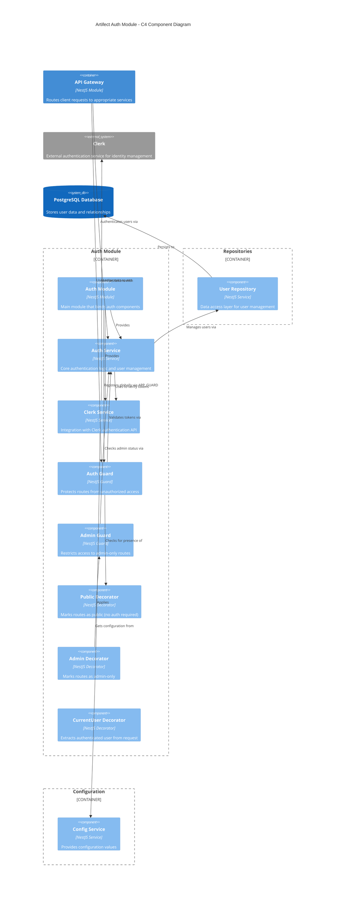

# Auth Module

This module provides authentication and authorization for the AI-Assisted Software Engineering Platform using [Clerk](https://clerk.com) as the identity provider.

## Overview

The Auth Module handles user authentication, token verification, and user management with integration to Clerk's authentication services.

## Architecture

The following C4 component diagram illustrates the structure and relationships within the Auth Module:



The diagram shows how the Auth Module integrates with the API Gateway, external Clerk service, and internal database through the User Repository.

## Configuration

The module requires the following environment variables:

```env
# Clerk configuration
CLERK_SECRET_KEY=sk_test_your_secret_key
CLERK_PUBLISHABLE_KEY=pk_test_your_publishable_key
CLERK_JWT_AUDIENCE=optional_audience_value
```

## Authentication Flow

1. **Token Extraction**: The `AuthGuard` extracts the JWT token from the Authorization header
2. **Token Verification**: The `ClerkService` verifies the token with Clerk
3. **User Management**: The `AuthService` retrieves or creates the user in our database
4. **Request Enhancement**: The user is attached to the request for use in controllers

## Components

### Guards

- **AuthGuard**: Protects routes by validating the authentication token
- **AdminGuard**: Ensures the authenticated user has admin privileges

### Decorators

- **@Public()**: Mark routes that don't require authentication
- **@Admin()**: Mark routes that require admin privileges
- **@CurrentUser()**: Extract the current user from the request

### Services

- **AuthService**: Main service that coordinates authentication
- **ClerkService**: Integration with the Clerk API

## Testing

### Integration Tests

The module includes integration tests that verify proper connection with Clerk:

```bash
# Run auth module integration tests
npm run test:integration -- src/auth/auth.integration.spec.ts
```

Required test environment variables:

- `CLERK_SECRET_KEY`: Your Clerk secret key
- `TEST_USER_CLERK_ID`: ID of a test user in your Clerk account

## Setting Up for Development

1. Create a Clerk account at [clerk.com](https://clerk.com)
2. Create an application in the Clerk dashboard
3. Copy your API keys from the Clerk dashboard
4. Set the environment variables in your `.env` file

## Setting Up for Testing

1. Create a test user in your Clerk dashboard
2. Copy the user ID for the test user
3. Add the test user ID to your `.env.test` file as `TEST_USER_CLERK_ID`

## E2E Testing Considerations

For E2E tests that require authentication:

1. Ensure the test environment has the proper Clerk configuration
2. Use test utilities to create authenticated test users
3. Properly clean up test data after tests complete
