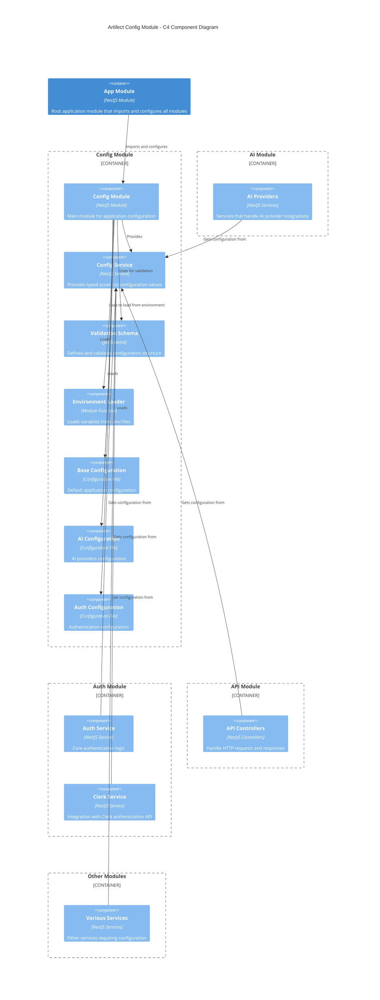

# Config Module

This module provides a centralized configuration system for the AI-Assisted Software Engineering Platform, offering type-safe access to configuration values, validation, and flexible loading options.

## Overview

The Config Module manages application configuration from various sources (environment variables, files) and provides validated, typed access to configuration values throughout the application. It uses [Joi](https://joi.dev/) for schema validation and NestJS's ConfigModule for integration.

## Architecture

The following C4 component diagram illustrates the structure and relationships within the Config Module:



The diagram shows how the Config Module integrates with the App Module and provides configuration to various services across different modules.

## Features

- **Centralized Configuration**: Single source of truth for all application settings
- **Type-Safe Access**: Strongly typed configuration access through ConfigService
- **Validation**: Schema-based validation using Joi
- **Environment Variables**: Loading from `.env` files
- **Configuration Composition**: Modular configuration from different domains
- **Defaults**: Sensible defaults for all configuration values

## Configuration Structure

The configuration is organized into modular domains:

### Base Configuration

Core application settings:

```typescript
// src/config/configuration.ts
export default () => ({
  port: parseInt(process.env.PORT || '3000', 10),
  database: {
    url: process.env.DATABASE_URL,
  },
  nodeEnv: process.env.NODE_ENV || 'development',
});
```

### AI Configuration

Settings for AI providers:

```typescript
// src/ai/ai.config.ts
export default () => ({
  ai: {
    defaultProvider: process.env.DEFAULT_AI_PROVIDER || 'anthropic',

    // OpenAI configuration
    openai: {
      apiKey: process.env.OPENAI_API_KEY,
      defaultModel: process.env.OPENAI_DEFAULT_MODEL || 'gpt-4',
      baseUrl: process.env.OPENAI_BASE_URL || 'https://api.openai.com/v1',
      organizationId: process.env.OPENAI_ORGANIZATION_ID,
    },

    // Anthropic configuration
    anthropic: {
      apiKey: process.env.ANTHROPIC_API_KEY,
      defaultModel:
        process.env.ANTHROPIC_DEFAULT_MODEL || 'claude-3-opus-20240229',
      baseUrl: process.env.ANTHROPIC_BASE_URL || 'https://api.anthropic.com',
      apiVersion: process.env.ANTHROPIC_API_VERSION || '2023-06-01',
    },
  },
});
```

### Auth Configuration

Settings for authentication:

```typescript
// src/auth/auth.config.ts
export default () => ({
  auth: {
    clerk: {
      apiKey: process.env.CLERK_API_KEY,
      jwksUrl: process.env.CLERK_JWKS_URL || 'https://api.clerk.dev/v1/jwks',
      apiBaseUrl: process.env.CLERK_API_BASE_URL || 'https://api.clerk.com/v1',
      jwtAudience: process.env.CLERK_JWT_AUDIENCE,
    },
  },
});
```

## Validation

Each configuration domain has its own validation schema:

```typescript
// src/config/validation.schema.ts
export const validationSchema = Joi.object({
  NODE_ENV: Joi.string()
    .valid('development', 'production', 'test')
    .default('development'),
  PORT: Joi.number().default(3000),
  DATABASE_URL: Joi.string().required(),
})
  .concat(aiConfigValidationSchema)
  .concat(authConfigValidationSchema);
```

These schemas define required fields, defaults, and valid values, ensuring configuration correctness at application startup.

## Usage

### App Module Configuration

```typescript
// src/app.module.ts
import { Module } from '@nestjs/common';
import { ConfigModule } from '@nestjs/config';
import configuration from './config/configuration';
import { validationSchema } from './config/validation.schema';
import aiConfiguration from './ai/ai.config';
import authConfiguration from './auth/auth.config';

@Module({
  imports: [
    ConfigModule.forRoot({
      isGlobal: true,
      load: [configuration, aiConfiguration, authConfiguration],
      validationSchema: validationSchema,
    }),
    // Other modules...
  ],
})
export class AppModule {}
```

### Using ConfigService in a Component

```typescript
import { Injectable } from '@nestjs/common';
import { ConfigService } from '@nestjs/config';

@Injectable()
export class MyService {
  constructor(private configService: ConfigService) {
    // Get a simple value with optional default
    const port = this.configService.get<number>('port', 3000);

    // Get a nested configuration value
    const apiKey = this.configService.get<string>('ai.anthropic.apiKey');

    // Get a configuration section
    const dbConfig = this.configService.get('database');
  }
}
```

## Environment Variables

Common environment variables used by the application:

### Core Configuration

- `NODE_ENV`: Application environment (`development`, `production`, `test`)
- `PORT`: Server port (default: 3000)
- `DATABASE_URL`: PostgreSQL connection string

### AI Configuration

- `DEFAULT_AI_PROVIDER`: Default AI provider (anthropic, openai)
- `ANTHROPIC_API_KEY`: Anthropic API key
- `ANTHROPIC_DEFAULT_MODEL`: Default Anthropic model (e.g., claude-3-opus-20240229)
- `OPENAI_API_KEY`: OpenAI API key
- `OPENAI_DEFAULT_MODEL`: Default OpenAI model (e.g., gpt-4)

### Auth Configuration

- `CLERK_API_KEY`: Clerk API key
- `CLERK_JWT_AUDIENCE`: JWT audience for token verification
- `CLERK_API_BASE_URL`: Clerk API base URL

## Testing

The Config Module includes unit tests to verify proper loading and validation:

```typescript
// src/config/config.spec.ts
import { Test } from '@nestjs/testing';
import { ConfigModule, ConfigService } from '@nestjs/config';
import configuration from './configuration';
import { validationSchema } from './validation.schema';

describe('ConfigModule', () => {
  let configService: ConfigService;

  beforeEach(async () => {
    const moduleRef = await Test.createTestingModule({
      imports: [
        ConfigModule.forRoot({
          load: [configuration],
          validationSchema: validationSchema,
          validationOptions: {
            allowUnknown: true,
            abortEarly: false,
          },
        }),
      ],
    }).compile();

    configService = moduleRef.get<ConfigService>(ConfigService);
  });

  it('should be defined', () => {
    expect(configService).toBeDefined();
  });

  it('should load port configuration', () => {
    expect(configService.get('port')).toBeDefined();
  });

  // More tests...
});
```

To run the tests:

```bash
# Run config module tests
npm run test:config
```

## Best Practices

1. **Environment-Specific Configuration**: Use `.env` files for different environments (`.env.development`, `.env.test`, `.env.production`)

2. **Secret Management**: Never commit sensitive values like API keys to source control

3. **Validation**: Always validate configuration at startup to fail fast if required values are missing

4. **Type Safety**: Use TypeScript types when accessing configuration values

5. **Defaults**: Provide sensible defaults for non-critical configuration

6. **Documentation**: Document all environment variables in README files

7. **Modularity**: Organize configuration by domain for better maintainability

## Adding New Configuration

To add new configuration to the system:

1. Define a new configuration file in the appropriate module
2. Create a validation schema for the new configuration
3. Add the configuration to the `ConfigModule.forRoot()` load array
4. Update the validation schema in `src/config/validation.schema.ts`
5. Document the new configuration in README files
