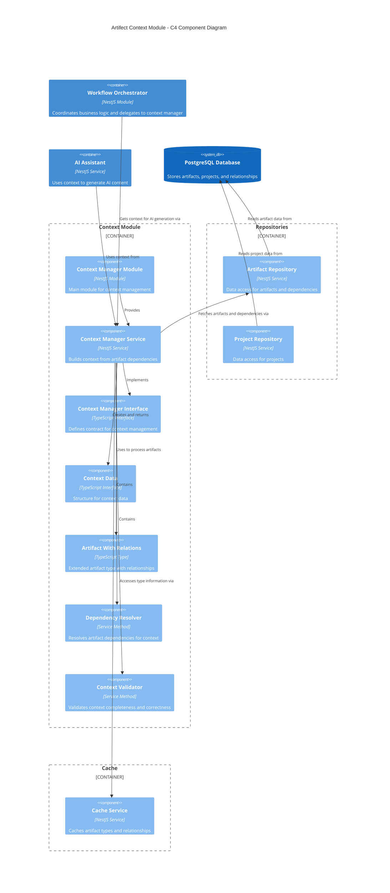

# Context Management Module

This module is responsible for gathering and organizing contextual information for artifact generation and updates.

## Overview

The Context Manager builds the complete context required for AI-assisted artifact generation based on the artifact type and dependencies. It resolves dependencies between different artifact types, ensuring that the appropriate previous artifacts are included in the context.

## Architecture

The following C4 component diagram illustrates the structure and relationships within the Context Module:



The diagram shows how the Context Module interacts with the Workflow Orchestrator, AI Assistant, repositories, and cache service to build comprehensive context for artifact generation.

## Features

- **Dynamic Context Building**: Builds context differently based on artifact type
- **Dependency Resolution**: Automatically includes required dependencies based on the artifact lifecycle
- **Validation**: Ensures all required context is available before proceeding
- **History Preservation**: Includes previous versions as needed for updates

## Usage

### Basic Usage

```typescript
import { ContextManagerService } from './context';

// Inject the service
constructor(private contextManager: ContextManagerService) {}

// Get context for artifact generation or update
async generateArtifact(artifact: Artifact, isUpdate: boolean, userMessage?: string) {
  const context = await this.contextManager.getContext(artifact, isUpdate, userMessage);

  // Use the context for template rendering or AI generation
  // ...
}
```

### Context Structure

```typescript
interface ContextData {
  // Project information
  project: {
    name: string;
    [key: string]: any;
  };

  // Artifact information
  artifact: {
    artifact_type_id: number;
    artifact_type_name: string;
    artifact_phase: string;
    name?: string; // For updates
    content?: string; // For updates
    [key: string]: any;
  };

  // Operation type
  is_update: boolean;

  // User message if provided
  user_message?: string | null;

  // Dependencies (added based on artifact type)
  vision?: string;
  functional_requirements?: string;
  non_functional_requirements?: string;
  use_cases?: string[];
  c4_context?: string;
  c4_container?: string;
  c4_components?: string[];

  // Additional custom fields
  [key: string]: any;
}
```

## Dependency Rules

The context manager enforces the following dependency rules for artifacts:

1. **Functional Requirements**: Requires Vision Document
2. **Non-Functional Requirements**: Requires Functional Requirements
3. **Use Cases**: Requires Non-Functional Requirements
4. **C4 Context**: Requires Use Cases
5. **C4 Container**: Requires C4 Context
6. **C4 Component**: Requires C4 Container

## Error Handling

If a required dependency is missing, the context manager will throw an error with a descriptive message, such as:

```
Vision document missing; a vision is requirement for context
```

These errors should be handled appropriately in the calling service to provide feedback to the user about missing dependencies.

## Extension

To add support for new artifact types or change dependency rules, update the `getContext` method in the `ContextManagerService`.
