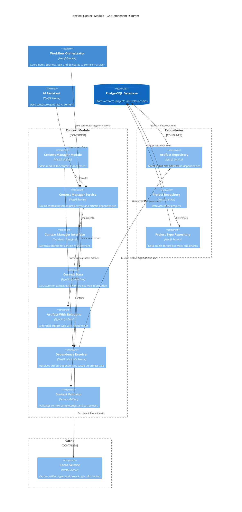

# Context Management Module

This module is responsible for gathering and organizing contextual information for artifact generation and updates, with support for multiple project types.

## Overview

The Context Manager builds the complete context required for AI-assisted artifact generation based on the artifact type, project type, and dependencies. It dynamically resolves dependencies between different artifact types according to the project type configuration, ensuring that the appropriate artifacts are included in the context.

## Architecture

The following C4 component diagram illustrates the structure and relationships within the Context Module:



The diagram shows how the Context Module interacts with the Workflow Orchestrator, AI Assistant, repositories, and cache service to build comprehensive context for artifact generation based on project types.

## Features

- **Dynamic Context Building**: Builds context differently based on artifact type and project type
- **Project Type Support**: Adapts context building based on the selected project type and its phases
- **Dependency Resolution**: Automatically includes required dependencies based on project type configuration
- **Validation**: Ensures all required context is available before proceeding
- **History Preservation**: Includes previous versions as needed for updates

## Usage

### Basic Usage

```typescript
import { ContextManagerService } from './context';

// Inject the service
constructor(private contextManager: ContextManagerService) {}

// Get context for artifact generation or update
async generateArtifact(artifact: Artifact, isUpdate: boolean, userMessage?: string) {
  const context = await this.contextManager.getContext(artifact, isUpdate, userMessage);

  // Use the context for template rendering or AI generation
  // ...
}
```

### Context Structure

```typescript
interface ContextData {
  // Project information
  project: {
    name: string;
    project_type_id: number | null; // Added for project type support
    project_type_name: string | null; // Added for project type support
    [key: string]: any;
  };

  // Artifact information
  artifact: {
    artifact_id: number;
    artifact_type_id: number;
    artifact_type_name: string;
    artifact_phase: string;
    name?: string; // For updates
    content?: string; // For updates
    [key: string]: any;
  };

  // Operation type
  is_update: boolean;

  // User message if provided
  user_message?: string | null;

  // Dependencies (added dynamically based on project type and artifact type)
  vision?: string;
  functional_requirements?: string;
  non_functional_requirements?: string;
  use_cases?: string[];
  c4_context?: string;
  c4_container?: string;
  c4_components?: string[];

  // Additional custom fields that may vary by project type
  [key: string]: any;
}
```

## Dependency Rules

The context manager enforces dependency rules for artifacts based on the project type configuration. Dependencies are now dynamically resolved using the DependencyResolver, which:

1. Identifies required dependencies based on artifact type and project type
2. Resolves multiple vs single-instance dependencies appropriately (e.g., Use Cases can have multiple instances)
3. Validates that all required dependencies are available
4. Includes the content from the current version of each dependency

For the default Software Engineering project type, dependencies follow this pattern:

1. **Functional Requirements**: Requires Vision Document
2. **Non-Functional Requirements**: Requires Functional Requirements
3. **Use Cases**: Requires Non-Functional Requirements
4. **C4 Context**: Requires Use Cases
5. **C4 Container**: Requires C4 Context
6. **C4 Component**: Requires C4 Container

Additional project types can define their own dependency structures.

## Project Types

The context manager now supports multiple project types, each with its own:

- Lifecycle phases
- Artifact types
- Dependency relationships

This decoupling allows the system to support various engineering and design methodologies beyond just software engineering. The DependencyResolver handles the complexity of identifying and resolving the appropriate dependencies for each project type.

## Error Handling

If a required dependency is missing, the context manager will throw an error with a descriptive message, such as:

```
Vision Document missing; Vision Document is required context
```

These errors should be handled appropriately in the calling service to provide feedback to the user about missing dependencies.

## Extension

To add support for new project types:

1. Add the project type and its phases to the database
2. Define artifact types for each phase
3. Configure the dependency relationships between artifact types
4. The Context Manager will automatically handle the new project type's context building

No code changes to the Context Manager are required when adding new project types as long as they follow the established data model.

## Component Details

### DependencyResolver

The DependencyResolver is a key component that:

- Determines required dependencies for each artifact type
- Handles both single-value and array-type dependencies
- Loads and processes the appropriate artifact contents
- Validates that all required dependencies exist
- Maps dependencies to the context using appropriate keys

The resolver is now an injectable service, properly integrated with the dependency injection system of NestJS.
