# Repositories Module

This module provides a structured data access layer for the AI-Assisted Software Engineering Platform, implementing the repository pattern to abstract database operations and provide type-safe domain-specific interfaces.

## Overview

The Repositories Module serves as the data access layer for the application, abstracting the underlying database and providing domain-specific interfaces for each entity type. It maintains a clean separation between the business logic and data access concerns, applying the repository pattern to improve maintainability and testability.

## Architecture

The following C4 component diagram illustrates the structure and relationships within the Repositories Module:

```mermaid
C4Component
    title Artifect Repositories Module - C4 Component Diagram

    Container(workflowOrchestrator, "Workflow Orchestrator", "NestJS Module", "Orchestrates business logic using repositories for data access")

    Container(contextManager, "Context Manager", "NestJS Module", "Builds context using artifacts and their dependencies")

    Container(apiControllers, "API Controllers", "NestJS Controllers", "Endpoints for accessing and manipulating data")

    Container_Boundary(repositoriesBoundary, "Repositories Module") {
        Component(repositoriesModule, "Repositories Module", "NestJS Module", "Main module that provides data access components")

        Component(baseInterface, "Base Repository Interface", "TypeScript Interface", "Generic CRUD operations interface")

        Component(projectRepo, "Project Repository", "NestJS Service", "Manages project data access")
        Component(projectInterface, "Project Repository Interface", "TypeScript Interface", "Project-specific operations")

        Component(artifactRepo, "Artifact Repository", "NestJS Service", "Manages artifact data access")
        Component(artifactInterface, "Artifact Repository Interface", "TypeScript Interface", "Artifact-specific operations")

        Component(stateRepo, "State Repository", "NestJS Service", "Manages state transitions data access")
        Component(stateInterface, "State Repository Interface", "TypeScript Interface", "State-specific operations")

        Component(reasoningRepo, "Reasoning Repository", "NestJS Service", "Manages reasoning data access")
        Component(reasoningInterface, "Reasoning Repository Interface", "TypeScript Interface", "Reasoning-specific operations")

        Component(userRepo, "User Repository", "NestJS Service", "Manages user data access")
    }

    Container_Boundary(cacheBoundary, "Cache Module") {
        Component(cacheService, "Cache Service", "NestJS Service", "Caches frequently accessed data")
    }

    Container_Boundary(databaseBoundary, "Database Module") {
        Component(prismaService, "Prisma Service", "NestJS Service", "ORM for database access")
    }

    SystemDb(database, "PostgreSQL Database", "Stores all application data")

    Rel(workflowOrchestrator, projectRepo, "Uses")
    Rel(workflowOrchestrator, artifactRepo, "Uses")
    Rel(workflowOrchestrator, stateRepo, "Uses")
    Rel(workflowOrchestrator, reasoningRepo, "Uses")

    Rel(contextManager, artifactRepo, "Uses")

    Rel(apiControllers, projectRepo, "Uses")
    Rel(apiControllers, artifactRepo, "Uses")
    Rel(apiControllers, userRepo, "Uses")

    Rel(repositoriesModule, projectRepo, "Provides")
    Rel(repositoriesModule, artifactRepo, "Provides")
    Rel(repositoriesModule, stateRepo, "Provides")
    Rel(repositoriesModule, reasoningRepo, "Provides")
    Rel(repositoriesModule, userRepo, "Provides")

    Rel(projectRepo, projectInterface, "Implements")
    Rel(projectInterface, baseInterface, "Extends")

    Rel(artifactRepo, artifactInterface, "Implements")
    Rel(artifactInterface, baseInterface, "Extends")

    Rel(stateRepo, stateInterface, "Implements")

    Rel(reasoningRepo, reasoningInterface, "Implements")

    Rel(projectRepo, prismaService, "Uses")
    Rel(artifactRepo, prismaService, "Uses")
    Rel(stateRepo, prismaService, "Uses")
    Rel(reasoningRepo, prismaService, "Uses")
    Rel(userRepo, prismaService, "Uses")

    Rel(artifactRepo, cacheService, "Uses")
    Rel(stateRepo, cacheService, "Uses")

    Rel(prismaService, database, "Connects to")

    UpdateRelStyle(workflowOrchestrator, projectRepo, $offsetY="-15")
    UpdateRelStyle(workflowOrchestrator, artifactRepo, $offsetY="-5")
    UpdateRelStyle(workflowOrchestrator, stateRepo, $offsetY="5")
    UpdateRelStyle(workflowOrchestrator, reasoningRepo, $offsetY="15")
```



The diagram shows how the Repositories Module acts as an intermediary between the business logic modules (like Workflow Orchestrator and Context Manager) and the database, providing specialized repository classes for each domain entity.

## Key Components

### Base Repository Interface

The `BaseRepositoryInterface` provides a generic template for standard CRUD operations that all repositories implement:

```typescript
export interface BaseRepositoryInterface<T, ID, CreateDTO, UpdateDTO> {
  create(data: CreateDTO): Promise<T>;
  findById(id: ID): Promise<T | null>;
  findAll(): Promise<T[]>;
  update(id: ID, data: UpdateDTO): Promise<T | null>;
  delete(id: ID): Promise<boolean>;
}
```

### Domain-Specific Repositories

#### Project Repository

Manages projects and provides project-specific operations:

```typescript
export interface ProjectRepositoryInterface
  extends BaseRepositoryInterface<
    Project,
    number,
    { name: string; userId: number },
    { name: string }
  > {
  findByIdAndUserId(id: number, userId: number): Promise<Project | null>;
  findByUserId(userId: number): Promise<Project[]>;
  getProjectMetadata(
    projectId: number,
    userId?: number,
  ): Promise<{
    id: number;
    name: string;
    currentPhaseId: number | null;
    currentPhaseName: string | null;
    lastUpdate: Date | null;
  } | null>;
  getPhaseArtifacts(
    projectId: number,
    phaseId: number,
    userId?: number,
  ): Promise<
    {
      id: number;
      type: string;
      content: string | null;
    }[]
  >;
  isProjectOwner(projectId: number, userId: number): Promise<boolean>;
}
```

#### Artifact Repository

Manages artifacts, versions, types, and states:

```typescript
export interface ArtifactRepositoryInterface
  extends BaseRepositoryInterface<
    Artifact,
    number,
    ArtifactCreateDTO,
    ArtifactUpdateDTO
  > {
  getArtifactsByProjectId(projectId: number): Promise<Artifact[]>;
  getArtifactsByProjectIdAndPhase(
    projectId: number,
    phase: string,
  ): Promise<Artifact[]>;
  getAvailableTransitions(artifact: Artifact): Promise<ArtifactState[]>;
  getArtifactStateByName(state: string): Promise<ArtifactState | null>;
  updateArtifactState(
    artifactId: number,
    newState: string,
  ): Promise<Artifact | null>;
  // ... additional methods
}
```

#### State Repository

Manages state transitions for artifacts:

```typescript
export interface StateRepositoryInterface {
  getCurrentState(artifactId: number): Promise<ArtifactState | null>;
  getAvailableTransitions(artifactId: number): Promise<ArtifactState[]>;
  transitionState(
    artifactId: number,
    newStateId: number,
  ): Promise<[boolean, string]>;
  getAllStates(): Promise<ArtifactState[]>;
  getAllTransitions(): Promise<StateTransition[]>;
}
```

#### Reasoning Repository

Manages reasoning summaries and points:

```typescript
export interface ReasoningRepositoryInterface {
  createReasoningSummary(
    artifactVersionId: number,
    reasoningEntryId: number,
    summary: string,
  ): Promise<ReasoningSummary>;
  getReasoningSummary(summaryId: number): Promise<ReasoningSummary | null>;
  createReasoningPoint(
    summaryId: number,
    category: string,
    point: string,
    importanceScore: number,
  ): Promise<ReasoningPoint>;
  // ... additional methods
}
```

#### User Repository

Manages user data and relationships:

```typescript
export interface UserRepositoryInterface {
  create(data: UserCreateDTO): Promise<User>;
  findById(id: number): Promise<User | null>;
  findByClerkId(clerkId: string): Promise<User | null>;
  findByEmail(email: string): Promise<User | null>;
  findAll(): Promise<User[]>;
  update(id: number, data: UserUpdateDTO): Promise<User | null>;
  delete(id: number): Promise<boolean>;
  updateAdminStatus(id: number, isAdmin: boolean): Promise<User | null>;
  getUserProjects(userId: number): Promise<any[]>;
}
```

## Repository Implementations

Each repository interface has a corresponding implementation class that uses PrismaService to execute database operations:

```typescript
@Injectable()
export class ArtifactRepository implements ArtifactRepositoryInterface {
  constructor(
    private prisma: PrismaService,
    private cacheService: CacheService,
  ) {}

  async create(data: ArtifactCreateDTO): Promise<Artifact> {
    try {
      // Implementation using prisma...
    } catch (error) {
      throw new Error(`Failed to create artifact: ${error.message}`);
    }
  }

  // Other method implementations...
}
```

## Integration with Cache Module

Several repositories integrate with the Cache Service to optimize performance:

```typescript
export class StateRepository implements StateRepositoryInterface {
  constructor(
    private prisma: PrismaService,
    private cacheService: CacheService,
  ) {}

  async isValidStateTransition(
    fromState: string,
    toState: string,
  ): Promise<boolean> {
    try {
      const fromStateId = await this.cacheService.getArtifactStateIdByName(
        fromState,
      );
      const toStateId = await this.cacheService.getArtifactStateIdByName(
        toState,
      );

      if (!fromStateId || !toStateId) {
        return false;
      }

      const transition = await this.prisma.stateTransition.findFirst({
        where: {
          fromStateId,
          toStateId,
        },
      });

      return !!transition;
    } catch (error) {
      throw new Error(`Error checking state transition: ${error.message}`);
    }
  }
}
```

## Error Handling

Repositories implement consistent error handling patterns:

```typescript
try {
  // Database operation
  return await this.prisma.artifact.update({
    where: { id },
    data: updateData,
    include: {
      artifactType: true,
      state: true,
      currentVersion: true,
    },
  });
} catch (error) {
  if (error instanceof Prisma.PrismaClientKnownRequestError) {
    // Handle specific Prisma errors
    if (error.code === 'P2025') {
      return null; // Record not found
    }
  }
  throw new Error(`Failed to update artifact: ${error.message}`);
}
```

## Transaction Support

For operations that need to maintain data consistency, repositories implement transaction support:

```typescript
// Create artifact and first version in a transaction
const result = await this.prisma.$transaction(async (tx) => {
  // Create the artifact
  const artifact = await tx.artifact.create({
    data: {
      projectId: data.projectId,
      artifactTypeId: data.artifactTypeId,
      name: data.name,
      stateId: inProgressStateId,
    },
  });

  // Create the first version
  const firstVersion = await tx.artifactVersion.create({
    data: {
      artifactId: artifact.id,
      versionNumber: 1,
      content: data.content,
    },
  });

  // Update the artifact with the current version
  return tx.artifact.update({
    where: { id: artifact.id },
    data: {
      currentVersionId: firstVersion.id,
    },
  });
});
```

## Usage Examples

### Module Integration

Import the Repositories Module in your application module:

```typescript
import { Module } from '@nestjs/common';
import { RepositoriesModule } from './repositories/repositories.module';

@Module({
  imports: [RepositoriesModule],
  // ...
})
export class AppModule {}
```

### Using a Repository

Inject and use a repository in a service:

```typescript
import { Injectable } from '@nestjs/common';
import { ProjectRepository } from './repositories/project.repository';

@Injectable()
export class ProjectService {
  constructor(private projectRepository: ProjectRepository) {}

  async createProject(name: string, userId: number) {
    return this.projectRepository.create({ name, userId });
  }

  async getUserProjects(userId: number) {
    return this.projectRepository.findByUserId(userId);
  }
}
```

## Testing

The repositories are designed to be easily testable:

```typescript
describe('ArtifactRepository', () => {
  let repository: ArtifactRepository;
  let prismaService: PrismaService;
  let cacheService: CacheService;

  beforeEach(async () => {
    const module = await Test.createTestingModule({
      providers: [
        ArtifactRepository,
        {
          provide: PrismaService,
          useValue: {
            artifact: {
              create: jest.fn(),
              findUnique: jest.fn(),
              findMany: jest.fn(),
              update: jest.fn(),
              delete: jest.fn(),
            },
            // Other Prisma models...
          },
        },
        {
          provide: CacheService,
          useValue: {
            getArtifactStateIdByName: jest.fn(),
            getArtifactTypeInfo: jest.fn(),
          },
        },
      ],
    }).compile();

    repository = module.get<ArtifactRepository>(ArtifactRepository);
    prismaService = module.get<PrismaService>(PrismaService);
    cacheService = module.get<CacheService>(CacheService);
  });

  it('should create an artifact', async () => {
    // Test implementation...
  });
});
```

## Best Practices

1. **Follow the Repository Pattern**: Keep database logic isolated within repositories
2. **Use Interfaces**: Define clear interfaces for all repositories
3. **Type Safety**: Utilize TypeScript for type-safe database operations
4. **Centralized Error Handling**: Implement consistent error handling across repositories
5. **Transaction Support**: Use transactions for operations that need to be atomic
6. **Unit Testing**: Thoroughly test repository methods with mocked dependencies
7. **Repository Composition**: Compose smaller repositories for complex operations
8. **Authorization Check**: Include user authorization in data access when needed
9. **Cache Integration**: Use cache for frequently accessed data
10. **Consistent Naming**: Follow consistent naming conventions for methods

## Extension

To add a new repository:

1. Define an interface in `interfaces/` directory, extending `BaseRepositoryInterface` if appropriate
2. Create implementation in a separate file named after the entity
3. Register the repository in the `RepositoriesModule`
4. Add appropriate unit and integration tests
