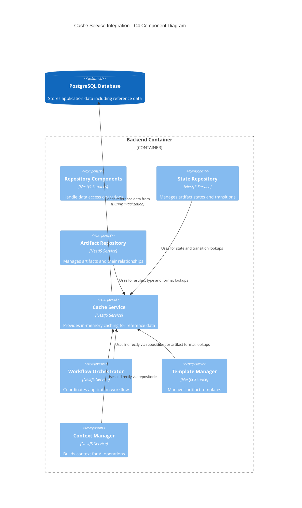

# Cache Service

The Cache Service provides in-memory caching capabilities for the AI-Assisted Software Engineering Platform to optimize database access and improve application performance.

## Overview

Located in `apps/backend/src/services/cache`, this service maintains in-memory caches of frequently accessed database entities like artifact types, states, and transitions. By reducing repetitive database queries, it significantly improves the performance of operations that require reference data.

## Architecture

The following C4 component diagram illustrates how the Cache Service integrates with the rest of the system:



## Key Components

The Cache Service implementation consists of:

1. **CacheService** (`cache.service.ts`) - The service implementation that:

   - Loads and maintains reference data in memory
   - Provides methods to access this data efficiently
   - Initializes automatically on application startup

2. **CacheServiceInterface** (`cache.service.interface.ts`) - Defines the interface with:

   - Method signatures for data access
   - Type definitions for cached entities

3. **CacheModule** (`cache.module.ts`) - NestJS module that:
   - Provides the Cache Service to the application
   - Imports required dependencies (PrismaService)

## Cached Entities

The Cache Service maintains the following caches:

- **Artifact Types** - Information about different artifact types (Vision, Requirements, etc.)
- **Artifact States** - Possible states for artifacts (To Do, In Progress, Approved)
- **State Transitions** - Valid transitions between artifact states
- **Lifecycle Phases** - Development lifecycle phases (Requirements, Design, etc.)
- **Artifact Formats** - Format specifications for different artifact types

## Key Methods

```typescript
interface CacheServiceInterface {
  // Initialize all caches from the database
  initialize(): Promise<void>;

  // Get a lifecycle phase ID by name
  getLifecyclePhaseIdByName(name: string): Promise<number | null>;

  // Get artifact type information by name
  getArtifactTypeInfo(name: string): Promise<ArtifactTypeInfo | null>;

  // Get artifact format specifications by slug
  getArtifactFormat(slug: string): Promise<ArtifactFormat>;

  // Get an artifact state ID by name
  getArtifactStateIdByName(name: string): Promise<number | null>;

  // Get a state transition ID
  getStateTransitionId(
    fromState: string,
    toState: string,
  ): Promise<number | null>;
}
```

## Usage

The Cache Service is used by repositories to optimize database access:

```typescript
// In a repository service constructor
constructor(
    private prisma: PrismaService,
    private cacheService: CacheService
) { }

// Example usage in a method
async isValidStateTransition(fromState: string, toState: string): Promise<boolean> {
    // Use cache to get state IDs instead of querying the database
    const transitionId = await this.cacheService.getStateTransitionId(fromState, toState);
    return transitionId !== null;
}

// Example of getting artifact type information
async getArtifactTypeByName(artifactType: string): Promise<ArtifactType | null> {
    const { typeId } = await this.cacheService.getArtifactTypeInfo(artifactType) || {};
    if (!typeId) {
        return null;
    }

    return this.prisma.artifactType.findUnique({
        where: { id: typeId }
    });
}
```

## Implementation Details

The Cache Service operates as follows:

1. **Initialization**

   - Automatically initializes on module startup via `onModuleInit()`
   - Loads reference data from the database into memory
   - Creates separate maps for each entity type

2. **Data Access**

   - Provides type-safe asynchronous methods to access cached data
   - Returns null for missing entries rather than throwing exceptions
   - Ensures cache is initialized before accessing data

3. **Cache Structure**
   - Uses Maps to store data with appropriate key structures
   - Maintains metadata beyond simple IDs where useful

## Benefits

- **Improved Performance** - Reduces database queries for frequently accessed data
- **Reduced Database Load** - Minimizes queries for relatively static reference data
- **Consistent Access Patterns** - Provides a unified interface for reference data
- **Type Safety** - Provides properly typed interfaces for cached data

## Module Integration

To use the Cache Service in a NestJS module:

```typescript
import { Module } from '@nestjs/common';
import { CacheModule } from '../services/cache/cache.module';

@Module({
  imports: [CacheModule],
  // ...
})
export class YourModule {}
```

Then inject the service into your components:

```typescript
import { Injectable } from '@nestjs/common';
import { CacheService } from '../services/cache/cache.service';

@Injectable()
export class YourService {
  constructor(private cacheService: CacheService) {}

  // Use the cache service methods...
}
```
