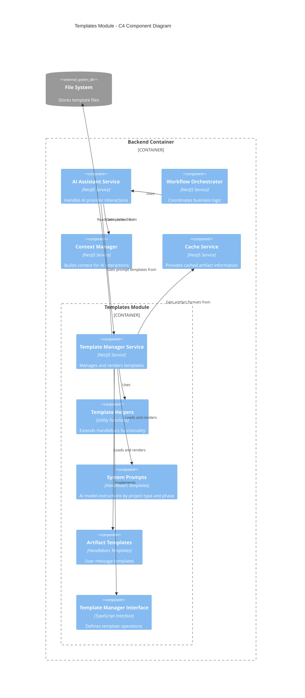

# Template Management System

This module provides a template management system for the AI-Assisted Software Engineering Platform. It uses a TypeScript-based Handlebars template system with support for multiple project types.

## Architecture

The template management system is responsible for loading and rendering templates, managing system prompts, and providing the necessary inputs for AI model interactions. Below is a C4 component diagram illustrating how the Templates Module integrates with the rest of the system:



## Project Type Support

The template system now supports multiple project types with isolated template directories. Each project type has its own directory of system prompts.

### Directory Structure

```
templates/
├── artifacts/
│   ├── artifact_new.hbs
│   └── artifact_update.hbs
├── interfaces/
│   └── template-manager.interface.ts
├── system-prompts/
│   ├── software-engineering/
│   │   ├── requirements-agent.hbs
│   │   ├── design-agent.hbs
│   │   └── data-agent.hbs
│   └── business-plan/
│       ├── market-analysis-agent.hbs
│       └── financial-projection-agent.hbs
└── README.md
```

### Naming Convention

1. **Project Type Directories**: Folders named with slugified project type names (e.g., `software-engineering`)
2. **Template Files**: Files named as `{phase-name}-agent.hbs` (e.g., `requirements-agent.hbs`)
3. **Artifact Templates**: Remain project-type agnostic (e.g., `artifact_new.hbs`)

### Template Loading and Caching

Templates are loaded and cached during service initialization:

1. **Artifact Templates**: Loaded from the `artifacts/` directory and cached by template name
2. **System Prompts**: Loaded from project type directories and cached with keys that include both the project type and template name:
   - Cache key format: `{project-type-slug}/{template-name}`
   - Example: `software-engineering/requirements-agent`

### Template Selection

Templates are selected based on context information:

1. For artifact templates, selection is based on whether it's a new or updated artifact
2. For system prompts, selection uses:
   - The project type ID from the context (resolved to a project type name)
   - The artifact phase from the context (converted to a template name)
   - Both are required for successful template selection

### Error Handling

The system will throw clear errors when:

- Project type ID is missing in context
- Artifact phase is missing in context
- Project type ID does not correspond to a known project type
- Template file is not found for the specified project type and phase
- No defaults are assumed - exact matches are required

## Key Components

### TemplateManagerService

The main service responsible for template management, with the following capabilities:

- Loading templates and system prompts from the filesystem by project type
- Rendering templates with context data
- Getting and rendering system prompts based on project type and phase
- Providing artifact input for AI generation

### Template Types

Two main types of templates are supported:

1. **Artifact Templates**: Used for generating user messages

   - `artifact_new.hbs`: Template for creating new artifacts
   - `artifact_update.hbs`: Template for updating existing artifacts

2. **System Prompts**: Used for instructing the AI model, organized by project type
   - `{project-type}/{phase}-agent.hbs`: Instructions for specific phases in specific project types

## Usage

### Getting System Prompts by Project Type

```typescript
const context = {
  project: {
    name: 'My Project',
    project_type_id: 1, // Software Engineering
  },
  artifact: {
    artifact_type_name: 'Vision Document',
    artifact_phase: 'requirements',
  },
};

// Will load and render system prompts/software-engineering/requirements-agent.hbs
const systemPrompt = await templateManager.getSystemPrompt(context);
```

### Complete Artifact Input Generation

```typescript
const context = {
  project: {
    name: 'My Project',
    project_type_id: 1,
  },
  artifact: {
    artifact_type_name: 'Vision Document',
    artifact_phase: 'requirements',
  },
  is_update: false,
};

// Gets appropriate system prompt, user message template, and artifact format
const input = await templateManager.getArtifactInput(context);
// {
//   systemPrompt: '... rendered system prompt ...',
//   template: '... rendered user message template ...',
//   artifactFormat: { startTag: '...', endTag: '...', syntax: '...' }
// }
```

## Adding New Project Types

To add support for a new project type:

1. Create a new directory under `system-prompts/` with the slugified project type name
2. Add phase-specific template files following the naming convention `{phase-name}-agent.hbs`
3. Ensure the project type is properly registered in the database
4. The template system will automatically load and use these templates when requested with the appropriate project type ID

## Handlebars Helpers

Custom helper functions that extend Handlebars templating capabilities:

- Conditional helpers (`ifEquals`, `ifContains`, etc.)
- Data manipulation helpers (`join`, `slice`, etc.)
- Formatting helpers (`formatDate`, `uppercase`, etc.)

## Testing

The module includes both unit and integration tests:

- Unit tests for testing the `TemplateManagerService` functionality
- Integration tests that test against the actual filesystem structure

Run tests with:

```bash
npm run test:templates
```
