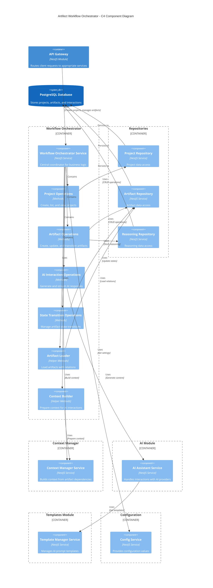

# Workflow Orchestration Module

This module is responsible for coordinating the entire workflow process of the AI-Assisted Software Engineering Platform.

## Architecture

The Workflow Orchestrator serves as the central coordinator that brings together all other modules to manage the lifecycle of projects and artifacts. It handles the creation and updating of artifacts, manages state transitions, coordinates AI interactions, and maintains version history. Below is a C4 component diagram illustrating the system architecture:



### Key Components

- **Workflow Orchestrator Service**: The main service that implements the `WorkflowOrchestratorInterface`, coordinating all business logic.

- **Operation Groups**:

  - **Project Operations**: Methods for creating, listing, and viewing projects
  - **Artifact Operations**: Methods for creating, updating, and managing artifacts
  - **AI Interaction Operations**: Methods for generating and streaming AI responses
  - **State Transition Operations**: Methods for managing artifact state transitions

- **Helper Components**:

  - **Artifact Loader**: Helper methods for loading artifacts with their relations
  - **Context Builder**: Helper methods for preparing context for AI interactions

- **Dependencies**:
  - **Repositories**: Data access layer for projects, artifacts, states, and reasoning
  - **Context Manager**: Builds context for AI interactions based on artifact relationships
  - **AI Module**: Handles interactions with AI providers
  - **Templates Module**: Manages Handlebars templates for AI prompts
  - **Configuration Service**: Provides application configuration settings

## Key Workflows

### Project Management

- **Creating a Project**: Initializes a new project entity in the database
- **Listing Projects**: Retrieves all projects or user-specific projects
- **Viewing Project Details**: Gets detailed project information including artifacts organized by phase

### Artifact Management

- **Creating an Artifact**: Creates a new artifact, initializes AI interaction, and generates initial content
- **Updating an Artifact**: Updates artifact properties and content, manages versions
- **Viewing Artifact Details**: Retrieves artifact details including chat history
- **Interacting with an Artifact**: Processes user messages, generates AI responses, and updates artifact content
- **Streaming Interactions**: Provides real-time streaming of AI responses for better user experience
- **Transitioning Artifact States**: Changes artifact states according to valid state transitions

## Interface

The Workflow Orchestrator implements the `WorkflowOrchestratorInterface` with the following main methods:

```typescript
interface WorkflowOrchestratorInterface {
  createProject(projectName: string, userId: number): Promise<ProjectMetadata>;
  listProjects(): Promise<ProjectMetadata[]>;
  listProjectsByUser(userId: number): Promise<ProjectMetadata[]>;
  viewProject(projectId: number, userId: number): Promise<ProjectDetails>;
  getArtifactDetails(
    artifactId: number,
    userId?: number,
  ): Promise<ArtifactDetails>;
  createArtifact(
    projectId: number,
    artifactTypeName: string,
    providerId?: string,
    model?: string,
    userId?: number,
  ): Promise<ArtifactDetails>;
  interactArtifact(
    artifactId: number,
    userMessage: string,
    providerId?: string,
    model?: string,
    userId?: number,
  ): Promise<ArtifactDetails>;
  streamInteractArtifact(
    artifactId: number,
    userMessage: string,
    onChunk: (chunk: string) => void,
    providerId?: string,
    model?: string,
    userId?: number,
  ): Promise<{ artifactContent: string; commentary: string }>;
  updateArtifact(
    artifactId: number,
    name: string,
    content: string,
    userId?: number,
  ): Promise<Artifact>;
  transitionArtifact(
    artifactId: number,
    newStateId: number,
    userId?: number,
  ): Promise<ArtifactDetails>;
}
```

## Response Structures

### Project Metadata

```typescript
{
  project_id: string;
  name: string;
  created_at: Date;
  updated_at: Date | null;
}
```

### Project Details

```typescript
{
  project_id: string;
  name: string;
  created_at: Date;
  updated_at: Date | null;
  artifacts: {
    [phase: string]: Array<{
      id: string | null;
      name: string;
      type: string;
      type_id: string;
      content: string | null;
      version_number: string | null;
      state_id: string | null;
      state_name: string | null;
      available_transitions: Array<{
        state_id: string;
        state_name: string;
      }>;
      dependent_type_id: string | null;
    }>;
  };
}
```

### Artifact Details

```typescript
{
  artifact: {
    artifact_id: string;
    artifact_type_id: string;
    artifact_type_name: string;
    artifact_version_number: string | null;
    artifact_version_content: string | null;
    name: string;
    state_id: string;
    state_name: string;
    available_transitions: Array<{
      state_id: string;
      state_name: string;
    }>;
    dependent_type_id: string | null;
  }
  chat_completion: {
    messages: Array<{
      role: string;
      content: string;
    }>;
  }
}
```

## Example Usage

### Module Integration

Include the `WorkflowOrchestratorModule` in your application module:

```typescript
import { Module } from '@nestjs/common';
import { WorkflowOrchestratorModule } from './workflow';

@Module({
  imports: [WorkflowOrchestratorModule],
  // ...
})
export class AppModule {}
```

### Basic Project Management

```typescript
import { Injectable } from '@nestjs/common';
import { WorkflowOrchestratorService } from './workflow';

@Injectable()
export class ProjectService {
  constructor(private workflowOrchestrator: WorkflowOrchestratorService) {}

  async createNewProject(name: string, userId: number) {
    return this.workflowOrchestrator.createProject(name, userId);
  }

  async getAllProjects() {
    return this.workflowOrchestrator.listProjects();
  }

  async getUserProjects(userId: number) {
    return this.workflowOrchestrator.listProjectsByUser(userId);
  }

  async getProjectDetails(id: number, userId: number) {
    return this.workflowOrchestrator.viewProject(id, userId);
  }
}
```

### Artifact Creation and Interaction

```typescript
import { Injectable } from '@nestjs/common';
import { WorkflowOrchestratorService } from './workflow';

@Injectable()
export class ArtifactService {
  constructor(private workflowOrchestrator: WorkflowOrchestratorService) {}

  async createNewArtifact(
    projectId: number,
    type: string,
    userId: number,
    provider?: string,
  ) {
    return this.workflowOrchestrator.createArtifact(
      projectId,
      type,
      provider,
      undefined,
      userId,
    );
  }

  async getArtifactWithHistory(artifactId: number, userId: number) {
    return this.workflowOrchestrator.getArtifactDetails(artifactId, userId);
  }

  async sendUserMessage(
    artifactId: number,
    message: string,
    userId: number,
    provider?: string,
  ) {
    return this.workflowOrchestrator.interactArtifact(
      artifactId,
      message,
      provider,
      undefined,
      userId,
    );
  }

  async changeArtifactState(
    artifactId: number,
    newStateId: number,
    userId: number,
  ) {
    return this.workflowOrchestrator.transitionArtifact(
      artifactId,
      newStateId,
      userId,
    );
  }
}
```

## Error Handling

The workflow orchestrator provides detailed error messages for various scenarios:

- **Not Found Errors**: When projects or artifacts don't exist
- **Validation Errors**: When required fields are missing or invalid
- **State Transition Errors**: When attempting invalid state transitions
- **Context Building Errors**: When required dependencies are missing for context
- **Authorization Errors**: When a user doesn't have access to the requested resource

## Future Improvements

- Add support for collaborative editing of artifacts
- Implement artifact templates for faster creation
- Add version comparison and diffing capabilities
- Implement artifact import/export functionality
- Add support for custom AI prompts
- Implement background processing for long-running tasks
- Add validation rules for artifact content
- Enhance the reasoning and explanation capabilities
