# Workflow Orchestration Module

This module is responsible for coordinating the entire workflow process of the AI-Assisted Software Engineering Platform, with support for multiple project types.

## Architecture

The Workflow Orchestrator serves as the central coordinator that brings together all other modules to manage the lifecycle of projects and artifacts. It handles the creation and updating of artifacts, manages state transitions, coordinates AI interactions, and maintains version history. Below is a C4 component diagram illustrating the system architecture:

```mermaid
C4Component
    title Artifect Workflow Orchestrator - C4 Component Diagram

    Container(apiGateway, "API Gateway", "NestJS Module", "Routes client requests to appropriate services")

    Container_Boundary(workflowBoundary, "Workflow Orchestrator") {
        Component(workflowService, "Workflow Orchestrator Service", "NestJS Service", "Central coordinator for business logic")

        Component(projectOps, "Project Operations", "Methods", "Create, list, and view projects with project type support")
        Component(artifactOps, "Artifact Operations", "Methods", "Create, update, and transition artifacts")
        Component(aiOps, "AI Interaction Operations", "Methods", "Generate and stream AI responses")
        Component(stateOps, "State Transition Operations", "Methods", "Manage artifact state transitions")

        Component(artifactLoader, "Artifact Loader", "Helper Methods", "Load artifacts with relations")
        Component(contextBuilder, "Context Builder", "Helper Methods", "Prepare context for AI interactions")
        Component(projectTypeValidator, "Project Type Validator", "Helper Methods", "Validate artifact types against project types")
    }

    Container_Boundary(repoBoundary, "Repositories") {
        Component(projectRepo, "Project Repository", "NestJS Service", "Project data access")
        Component(artifactRepo, "Artifact Repository", "NestJS Service", "Artifact data access")
        Component(reasoningRepo, "Reasoning Repository", "NestJS Service", "Reasoning data access")
        Component(projectTypeRepo, "Project Type Repository", "NestJS Service", "Project type data access")
    }

    Container_Boundary(contextBoundary, "Context Manager") {
        Component(contextService, "Context Manager Service", "NestJS Service", "Builds context from artifact dependencies")
    }

    Container_Boundary(aiBoundary, "AI Module") {
        Component(aiAssistant, "AI Assistant Service", "NestJS Service", "Handles interactions with AI providers")
    }

    Container_Boundary(templatesBoundary, "Templates Module") {
        Component(templateManager, "Template Manager Service", "NestJS Service", "Manages AI prompt templates")
    }

    Container_Boundary(configBoundary, "Configuration") {
        Component(configService, "Config Service", "NestJS Service", "Provides configuration values")
    }

    SystemDb(database, "PostgreSQL Database", "Stores projects, artifacts, and interactions")

    Rel(apiGateway, workflowService, "Uses", "Creates projects, manages artifacts")

    Rel(workflowService, projectOps, "Contains")
    Rel(workflowService, artifactOps, "Contains")
    Rel(workflowService, aiOps, "Contains")
    Rel(workflowService, stateOps, "Contains")
    Rel(workflowService, artifactLoader, "Uses")
    Rel(workflowService, contextBuilder, "Uses")
    Rel(workflowService, projectTypeValidator, "Uses")

    Rel(projectOps, projectRepo, "Uses", "CRUD operations")
    Rel(projectOps, projectTypeRepo, "Uses", "Get project types")
    Rel(artifactOps, artifactRepo, "Uses", "CRUD operations")
    Rel(artifactOps, reasoningRepo, "Uses", "Store reasoning")
    Rel(aiOps, contextService, "Uses", "Build context")
    Rel(aiOps, aiAssistant, "Uses", "Generate content")
    Rel(stateOps, artifactRepo, "Uses", "Update states")

    Rel(artifactLoader, artifactRepo, "Uses", "Load relations")
    Rel(artifactLoader, projectTypeRepo, "Uses", "Load project types")
    Rel(contextBuilder, contextService, "Uses", "Prepare context")
    Rel(workflowService, configService, "Uses", "Get settings")
    Rel(aiAssistant, templateManager, "Uses", "Get templates")

    Rel(projectRepo, database, "Persists to")
    Rel(artifactRepo, database, "Persists to")
    Rel(reasoningRepo, database, "Persists to")
    Rel(projectTypeRepo, database, "Persists to")
```



### Key Components

- **Workflow Orchestrator Service**: The main service that implements the `WorkflowOrchestratorInterface`, coordinating all business logic.

- **Operation Groups**:

  - **Project Operations**: Methods for creating, listing, and viewing projects with project type support
  - **Artifact Operations**: Methods for creating, updating, and managing artifacts
  - **AI Interaction Operations**: Methods for generating and streaming AI responses
  - **State Transition Operations**: Methods for managing artifact state transitions

- **Helper Components**:

  - **Artifact Loader**: Helper methods for loading artifacts with their relations
  - **Context Builder**: Helper methods for preparing context for AI interactions
  - **Project Type Validator**: Helper methods for validating artifacts against project types

- **Dependencies**:
  - **Repositories**: Data access layer for projects, artifacts, states, reasoning, and project types
  - **Context Manager**: Builds context for AI interactions based on artifact relationships
  - **AI Module**: Handles interactions with AI providers
  - **Templates Module**: Manages Handlebars templates for AI prompts
  - **Configuration Service**: Provides application configuration settings

## Key Workflows

### Project Management

- **Creating a Project**: Initializes a new project entity in the database with a specific or default project type
- **Listing Projects**: Retrieves all projects or user-specific projects with project type information
- **Viewing Project Details**: Gets detailed project information including artifacts organized by phase based on project type

### Artifact Management

- **Creating an Artifact**: Creates a new artifact (validating against project type), initializes AI interaction, and generates initial content
- **Updating an Artifact**: Updates artifact properties and content, manages versions
- **Viewing Artifact Details**: Retrieves artifact details including chat history and project type information
- **Interacting with an Artifact**: Processes user messages, generates AI responses, and updates artifact content
- **Streaming Interactions**: Provides real-time streaming of AI responses for better user experience
- **Transitioning Artifact States**: Changes artifact states according to valid state transitions

## Project Type Support

The Workflow Orchestrator now supports multiple project types, each with its own:

- **Lifecycle Phases**: Different phases based on the project methodology (e.g., "Requirements" and "Design" for software engineering)
- **Artifact Types**: Different artifact types for each phase (e.g., "Vision Document" for the Requirements phase)
- **Validation Rules**: Ensures artifacts are created in the appropriate phase for the project type

When creating a project, you can specify a project type or use the default. The workflow orchestrator ensures:

- All artifact operations respect the project type constraints
- Context includes project type information for AI generation
- Phases displayed in the project view match the project type
- Artifact types are validated against the project type before creation

## Interface

The Workflow Orchestrator implements the `WorkflowOrchestratorInterface` with the following main methods:

```typescript
interface WorkflowOrchestratorInterface {
  createProject(
    projectName: string,
    userId: number,
    projectTypeId?: number,
  ): Promise<ProjectMetadata>;

  listProjects(): Promise<ProjectMetadata[]>;

  listProjectsByUser(userId: number): Promise<ProjectMetadata[]>;

  viewProject(projectId: number, userId: number): Promise<ProjectDetails>;

  getArtifactDetails(
    artifactId: number,
    userId?: number,
  ): Promise<ArtifactDetails>;

  createArtifact(
    projectId: number,
    artifactTypeName: string,
    providerId?: string,
    model?: string,
    userId?: number,
  ): Promise<ArtifactDetails>;

  interactArtifact(
    artifactId: number,
    userMessage: string,
    providerId?: string,
    model?: string,
    userId?: number,
  ): Promise<ArtifactDetails>;

  streamInteractArtifact(
    artifactId: number,
    userMessage: string,
    onChunk: (chunk: string) => void,
    providerId?: string,
    model?: string,
    userId?: number,
  ): Promise<{ artifactContent: string; commentary: string }>;

  updateArtifact(
    artifactId: number,
    name: string,
    content: string,
    userId?: number,
  ): Promise<Artifact>;

  transitionArtifact(
    artifactId: number,
    newStateId: number,
    userId?: number,
  ): Promise<ArtifactDetails>;
}
```

## Response Structures

### Project Metadata

```typescript
{
  project_id: string;
  name: string;
  created_at: Date;
  updated_at: Date | null;
  project_type_id: string;
  project_type_name: string;
}
```

### Project Details

```typescript
{
  project_id: string;
  name: string;
  created_at: Date;
  updated_at: Date | null;
  project_type_id: string;
  project_type_name: string;
  artifacts: {
    [phase: string]: Array<{
      id: string | null;
      name: string;
      type: string;
      type_id: string;
      content: string | null;
      version_number: string | null;
      state_id: string | null;
      state_name: string | null;
      available_transitions: Array<{
        state_id: string;
        state_name: string;
      }>;
      dependent_type_id: string | null;
    }>;
  };
}
```

### Artifact Details

```typescript
{
  artifact: {
    artifact_id: string;
    artifact_type_id: string;
    artifact_type_name: string;
    artifact_version_number: string | null;
    artifact_version_content: string | null;
    name: string;
    state_id: string;
    state_name: string;
    available_transitions: Array<{
      state_id: string;
      state_name: string;
    }>;
    dependent_type_id: string | null;
    project_type_id: string;
    project_type_name: string;
  }
  chat_completion: {
    messages: Array<{
      role: string;
      content: string;
    }>;
  }
}
```

## Example Usage

### Module Integration

Include the `WorkflowOrchestratorModule` in your application module:

```typescript
import { Module } from '@nestjs/common';
import { WorkflowOrchestratorModule } from './workflow';

@Module({
  imports: [WorkflowOrchestratorModule],
  // ...
})
export class AppModule {}
```

### Project Management with Project Types

```typescript
import { Injectable } from '@nestjs/common';
import { WorkflowOrchestratorService } from './workflow';

@Injectable()
export class ProjectService {
  constructor(private workflowOrchestrator: WorkflowOrchestratorService) {}

  async createNewProject(name: string, userId: number, projectTypeId?: number) {
    return this.workflowOrchestrator.createProject(name, userId, projectTypeId);
  }

  async createSoftwareEngineeringProject(name: string, userId: number) {
    // Using specific project type ID for Software Engineering
    return this.workflowOrchestrator.createProject(name, userId, 1);
  }

  async createProductDesignProject(name: string, userId: number) {
    // Using specific project type ID for Product Design
    return this.workflowOrchestrator.createProject(name, userId, 2);
  }

  async getAllProjects() {
    return this.workflowOrchestrator.listProjects();
  }

  async getUserProjects(userId: number) {
    return this.workflowOrchestrator.listProjectsByUser(userId);
  }

  async getProjectDetails(id: number, userId: number) {
    return this.workflowOrchestrator.viewProject(id, userId);
  }
}
```

### Artifact Creation and Interaction

```typescript
import { Injectable } from '@nestjs/common';
import { WorkflowOrchestratorService } from './workflow';

@Injectable()
export class ArtifactService {
  constructor(private workflowOrchestrator: WorkflowOrchestratorService) {}

  async createNewArtifact(
    projectId: number,
    type: string,
    userId: number,
    provider?: string,
  ) {
    // The service will validate if the artifact type is valid for the project's type
    return this.workflowOrchestrator.createArtifact(
      projectId,
      type,
      provider,
      undefined,
      userId,
    );
  }

  async getArtifactWithHistory(artifactId: number, userId: number) {
    return this.workflowOrchestrator.getArtifactDetails(artifactId, userId);
  }

  async sendUserMessage(
    artifactId: number,
    message: string,
    userId: number,
    provider?: string,
  ) {
    return this.workflowOrchestrator.interactArtifact(
      artifactId,
      message,
      provider,
      undefined,
      userId,
    );
  }

  async changeArtifactState(
    artifactId: number,
    newStateId: number,
    userId: number,
  ) {
    return this.workflowOrchestrator.transitionArtifact(
      artifactId,
      newStateId,
      userId,
    );
  }
}
```

## Error Handling

The workflow orchestrator provides detailed error messages for various scenarios:

- **Not Found Errors**: When projects or artifacts don't exist
- **Validation Errors**: When required fields are missing or invalid
- **State Transition Errors**: When attempting invalid state transitions
- **Context Building Errors**: When required dependencies are missing for context
- **Authorization Errors**: When a user doesn't have access to the requested resource
- **Project Type Errors**: When an artifact type isn't valid for a project type

## Future Improvements

- Add support for collaborative editing of artifacts
- Implement artifact templates for faster creation
- Add version comparison and diffing capabilities
- Implement artifact import/export functionality
- Add support for custom AI prompts
- Implement background processing for long-running tasks
- Add validation rules for artifact content
- Enhance the reasoning and explanation capabilities
- Support for more project types and methodologies
- Custom artifact type creation within project types
